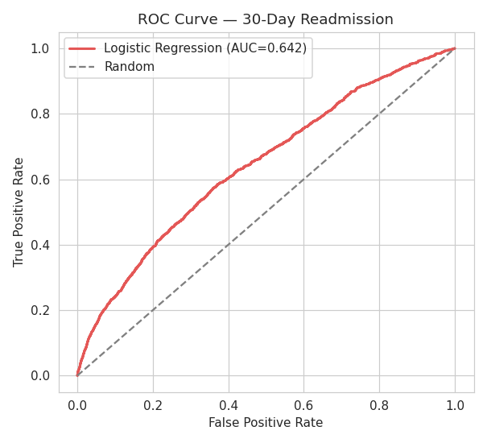
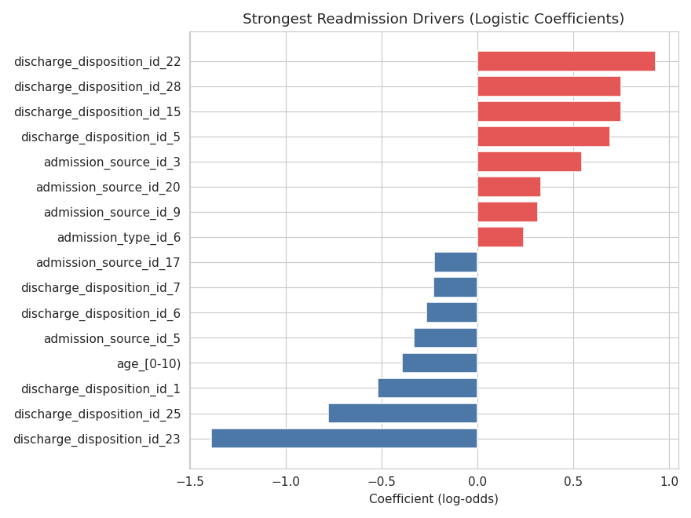

# Hospital Readmission Analysis

Which diabetic patients end up back in the hospital within 30 days, and why?

I used the UCI Diabetes 130-hospital dataset (about 102k inpatient stays, 1999-2008) to build a model that predicts 30-day readmission and, more usefully, ranks what actually drives it. The honest headline: this is a hard prediction problem. My logistic regression gets a test ROC-AUC of about 0.64, which lines up with what published papers on this dataset report (roughly 0.62 to 0.68). Gradient boosting didn't beat it, so I kept the model you can actually explain.

**View the full analysis (rendered):**

[Notebook 1 - Cleaning & EDA](https://nbviewer.org/github/Rishitav750/hospital-readmission-analysis/blob/main/hospital-readmission-analysis/notebooks/01_data_cleaning_and_eda.ipynb) 

[Notebook 2 - Modeling](https://nbviewer.org/github/Rishitav750/hospital-readmission-analysis/blob/main/hospital-readmission-analysis/notebooks/02_modeling_and_evaluation.ipynb)

## The data

Diabetes 130-US Hospitals, from the UCI ML Repository. ~101,766 encounters, 50 columns covering demographics, diagnoses, meds, a couple of lab results, and admission/discharge codes. Download notes are in `data/README.md` (the raw CSV is ~19MB so it's gitignored, not committed).

## What I did

I framed it as binary: readmitted in under 30 days = 1, everything else = 0.

A few cleaning calls that actually mattered:
- Kept only the first encounter per patient. The same patient shows up multiple times, and leaving all rows in leaks future info into the model.
- Dropped encounters where the patient died or went to hospice. They can't be readmitted, so keeping them just poisons the label.
- Tossed `weight`, `payer_code`, and `medical_specialty` since they're mostly empty.

After that I'm left with ~70k rows and about a 9% readmission rate. That imbalance is why I report ROC-AUC and PR-AUC instead of accuracy (a model that predicts "no" every time would be 91% accurate and completely useless).

Then: EDA in notebook 1, modeling in notebook 2. SQL versions of the exploratory cuts are in `sql/readmission_eda.sql` if you'd rather read it that way.

## What came out

Logistic regression, ~0.64 ROC-AUC on a held-out test set. Boosting landed in the same place, so the extra complexity bought nothing.

The drivers are the interesting part, and they make clinical sense:
- Discharge disposition (where the patient goes after they leave) is the strongest single signal.
- Number of prior inpatient visits. People who've been admitted before come back.
- Admission source and type, with emergency routes carrying more risk.
- Age, skewing higher in the older bands.




## Layout

```
data/      download instructions (CSV not committed)
sql/       exploratory queries
notebooks/ 01 = cleaning + EDA, 02 = modeling
outputs/   the charts
```

## Running it

```bash
pip install -r requirements.txt
# drop diabetic_data.csv into data/ first (see data/README.md)
jupyter notebook
```

Run notebook 01, then 02.

## What I'd flag / do next

The model is only okay, and that's mostly the data: it's administrative records from 1999-2008, with no lab trends over time, nothing on social factors, and nothing about what happened after discharge. Predicting *early* readmission specifically is just hard.

If I kept going, the useful next step is calibrating the probabilities and picking a threshold around whatever recall the care team actually needs. After that, a small dashboard that sorts discharges by risk score would make it usable by someone who isn't going to open a notebook.

Built with Python (pandas, scikit-learn, matplotlib, seaborn) and SQL.
